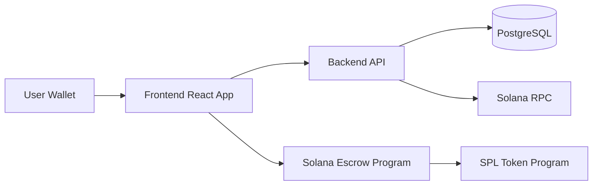

# split Architecture

## Overview

`split` is a Solana-based escrow platform for freelance contracts with two primary actors:

- `customer` - creates and funds contracts.
- `user` - accepts tasks and receives payouts.

The system is organized as a monorepo with separated frontend, backend, and on-chain layers.

## High-level architecture

## Components

### Frontend (`frontend/`)

- React + TypeScript + Vite app.
- Handles onboarding (`connect wallet` -> `select role`) and contracts UX.
- Signs wallet messages/transactions and sends authenticated requests to backend.
- Presents role-specific actions and statuses for contract lifecycle.

### Backend (`backend/`)

- REST API for auth, role profile, and contracts.
- Verifies wallet signatures for login.
- Stores off-chain metadata and contract index for fast querying.
- Coordinates on-chain transaction awareness (polling/webhook/subscription strategy).

### Contracts (`contracts/`)

- Solana program that represents escrow state transitions.
- Enforces role permissions and allowed state changes.
- Supports escrow actions such as fund, accept, submit, approve, and dispute.

## Data boundaries

- On-chain:
  - Escrow state, ownership/authority, token movement guarantees.
- Off-chain:
  - Rich metadata, filtering, search, UI-friendly projections, analytics.
- Client:
  - Session state and interaction flow.

## Contract lifecycle (target MVP)

1. `customer` creates contract metadata.
2. `customer` funds escrow.
3. `user` accepts and starts work.
4. `user` submits result.
5. `customer` approves and releases payout or opens dispute.

## Security model

- Wallet-based authentication for API access.
- Role-bound endpoint access (`customer` and `user`).
- On-chain authority checks for critical money movement operations.
- Input validation and explicit state machine transitions.

## Why this architecture

- Keeps money-critical rules auditable on-chain.
- Keeps UX and iteration speed high with backend indexing.
- Supports incremental delivery during hackathon without compromising final direction.
