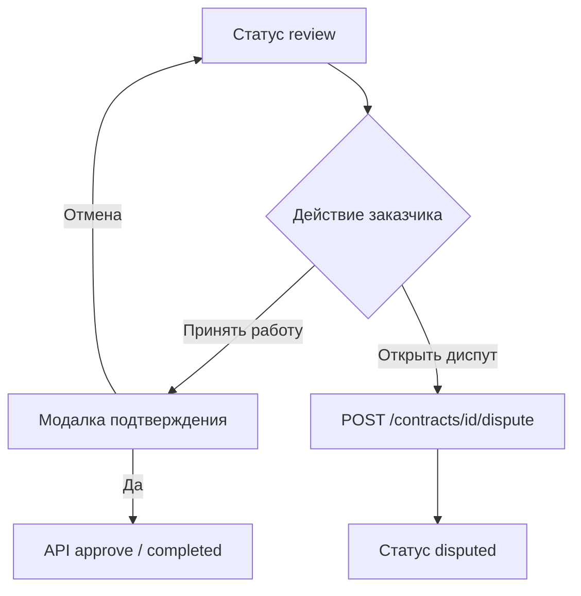
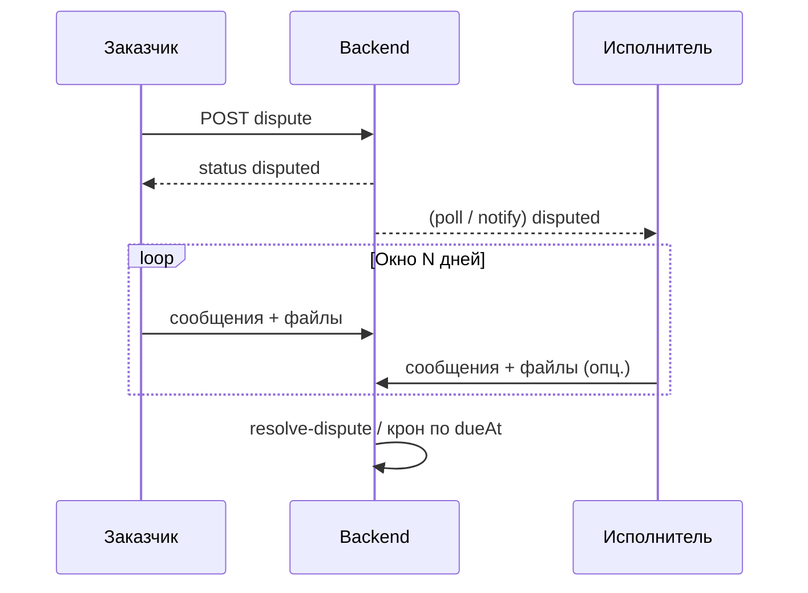

# Реализация: окно диспута, приёмка работы и экран спора

Документ описывает продуктовый флоу и технические шаги для: выбора срока диспута при создании контракта, подтверждения выполнения работы заказчиком, модального подтверждения, экрана диспута с вложениями и комментариями, а также отображения активных споров в профиле и у исполнителя.

**Связанный контекст в репозитории:**

- Жизненный цикл и API: `backend/src/routes/contracts.ts` (`POST /contracts/:id/dispute`, `POST /contracts/:id/resolve-dispute`, переходы статусов).
- Схема БД: `backend/prisma/schema.prisma` (`ContractStatus.disputed`, поля `disputeOpenedBy`, `disputeOpenedAt`, `disputeOutcome`, `disputeResolvedAt`).
- AI-бриф по спору (опционально для UI): `docs/qvac-ai-arbitration-plan.md`, эндпоинты в `backend/src/routes/ai-outputs.ts`.
- Ролевой UX (фильтры, быстрые действия): `docs/implementation-plan.md` (раздел про `Disputed`).

---

## 1. Термины

| Термин | Значение |
|--------|----------|
| Заказчик | Роль `customer` |
| Исполнитель | Роль `user` |
| Окно диспута | Количество календарных дней `N` с момента открытия спора, в течение которых стороны обмениваются позицией и материалами; по истечении — правило продукта (ручное разрешение, арбитр, автоисход — см. раздел 8). |
| Приёмка | Решение заказчика в статусе `review`: принять работу (переход к `completed` / выплата по вашей модели) или открыть диспут. |

---

## 2. Выбор числа дней на диспут при создании контракта

### 2.1 Продукт

- На этапе создания/редактирования контракта заказчик задаёт **срок разрешения диспута** (например: 3 / 7 / 14 дней).
- Значение показывается исполнителю до принятия контракта (summary / карточка заказа).
- Дефолт: фиксированное значение из конфига (например 7), если пользователь не менял.

### 2.2 Данные и API

**Модель `Contract` (Prisma):**

- Добавить поле, например `disputeResolutionDays Int` с `@default(7)` и ограничением в приложении (`min` / `max`, напр. 1–30).

**Создание / обновление:**

- Расширить `CreateContractInput` и `PatchContractInput` в `backend/src/routes/contracts.ts`: `disputeResolutionDays: z.number().int().min(1).max(30).optional()`.
- Включить поле в сериализацию ответа `GET /contracts` и `GET /contracts/:id` (camelCase для JSON, как у остальных полей).

**Ончейн (если применимо позже):**

- При необходимости продублировать параметр в инструкции инициализации escrow; до этого хранить только в БД и использовать в бизнес-логике и UI.

### 2.3 Фронтенд

- Страницы потока создания контракта (например цепочка с `SelectTemplatePage` и формой условий): селект или сегментированный контрол «Срок на разрешение диспута».
- Краткий текст-подсказка рядом с контролом (без юридического тона, если отдельный legal review).
- Отображение выбранного `N` в превью контракта для исполнителя.

---

## 3. Кнопка «Подтвердить выполнение работ» (приёмка)

### 3.1 Где показывать

| Роль | Место | Поведение |
|------|--------|-----------|
| Заказчик | Детальная страница контракта `/contracts/:id` в статусе `review` | Основной CTA: **Принять работу**. Рядом вторичное действие: **Открыть диспут** (или **Не принимаю результат** → тот же флоу диспута). |
| Заказчик | Список контрактов (карточка в `review`) | Те же действия в виде быстрых кнопок или меню «⋯», чтобы не заставлять заходить в детали. |
| Исполнитель | Статус `review` | Кнопки «Принять работу» **нет**. Показать баннер: «Ожидается решение заказчика» + ссылка на детали и сданные материалы. |

### 3.2 Принцип

Одна точка принятия результата — у заказчика. Исполнитель уже выполнил действие «Сдать работу» на предыдущем шаге.

---

## 4. Модальное окно подтверждения приёмки

### 4.1 Содержимое

- **Заголовок:** например «Подтвердить, что работа выполнена?»
- **Текст:** что произойдёт после подтверждения (выплата исполнителю / закрытие escrow — в соответствии с реальной логикой продукта); что после подтверждения путь «оспорить как новый диспут» недоступен, если так зафиксировано в правилах.
- **Кнопки:** **Отмена** | **Да, принять**.

### 4.2 Ветвление

- **Отмена:** закрыть модалку, без изменения статуса.
- **Да, принять:** вызвать существующий API приёмки (аналог текущего перехода в `completed` / запись `approveTxSignature` — как уже реализовано в `contracts.ts`).
- **Открыть диспут** не прячется внутри модалки успешного принятия; это отдельное явное действие рядом с «Принять работу», чтобы не путать пользователя.

### 4.3 Диаграмма (заказчик, статус `review`)

---

## 5. Флоу диспута для обеих сторон

### 5.1 Открытие

- Инициатор: по текущему ТЗ — заказчик при несогласии с результатом в `review`; при необходимости расширить правила, чтобы и исполнитель мог открыть спор из других статусов (уже частично отражено в `OpenDisputeRequest` и проверках статуса на бэкенде).
- Вызов: `POST /contracts/:id/dispute` с телом `{ reason?: string }` (расширить при необходимости).
- После успеха: `status = disputed`, заполняются `disputeOpenedBy`, `disputeOpenedAt`.

### 5.2 Вычисление дедлайна окна

- **Вариант A (проще для отчётов):** при открытии диспута записать `disputeDueAt = disputeOpenedAt + disputeResolutionDays` (потребует нового поля в Prisma).
- **Вариант B:** не хранить `disputeDueAt`, вычислять на клиенте и в API из `disputeOpenedAt + N`.

Рекомендация: поле `disputeDueAt` в БД для единообразия, кронов и аудита.

### 5.3 Экран диспута (общий для ролей с разными подсказками)

**Обязательные блоки UI:**

1. **Дисклеймер** — нейтральный текст: срок окна, что вложения и комментарии отражают позицию стороны, ограничение ответственности платформы (по согласованию с legal).
2. **Статус и таймер** — «Открыт …», «Ответ до …» на основе `disputeDueAt` или вычисления.
3. **Загрузка файлов** — мультивыбор, список прикреплённых файлов, лимиты размера и MIME (настраиваемо).
4. **Поле комментария** — многострочный ввод.
5. **Кнопка Save** — сохранение черновика или отправка сообщения в ленту диспута (см. ниже).

**Заказчик:** акцент на формулировке претензии и доказательствах.

**Исполнитель:** текст в духе «По договору открыт диспут. Вы можете ознакомиться с историей и при необходимости загрузить уточняющие материалы (необязательно).»

### 5.4 Бэкенд: вложения и история

Сейчас в `Contract` есть только `disputeOpened*` / `disputeOutcome`. Для полноценного экрана нужны новые сущности, например:

- **`DisputeMessage`** (или `DisputeEvent`): `id`, `contractId`, `authorWallet` / роль, `body` (текст), `createdAt`, опционально `updatedAt`.
- **`DisputeAttachment`**: `id`, `messageId` или `contractId` + `uploadedBy`, `storageKey` / URL, `fileName`, `mimeType`, `size`, `createdAt`.

**Эндпоинты (черновик):**

- `POST /contracts/:id/dispute/messages` — создать сообщение (тело + опционально список уже загруженных `attachmentId`).
- `POST /contracts/:id/dispute/attachments` — presigned upload или multipart → возвращает `attachmentId`.
- `GET /contracts/:id/dispute` — агрегат: контракт, дедлайн, лента сообщений с вложениями, метаданные.

Правила доступа: только `customerAddress` и `assigneeAddress` контракта.

### 5.5 Завершение спора

- Существующий `POST /contracts/:id/resolve-dispute` с `outcome`: связать с UI только для доверенных ролей или оператора/арбитра — в соответствии с текущей политикой (`executeOnChainResolve` в `arbiter.ts`).
- После `disputeResolvedAt` / смены статуса экран диспута переводится в режим «Закрыт» с итогом.

---

## 6. Профиль: «Открытый диспут»

### 6.1 Продукт

- В профиле пользователя блок **«Активные диспуты»**: список контрактов со статусом `disputed`, где пользователь — заказчик или исполнитель.
- Карточка: название контракта, контрагент, дедлайн окна, краткий статус (например «Ожидает ответа» / «На рассмотрении»).

### 6.2 Реализация

- **Вариант A:** `GET /contracts?status=disputed&role=...` с фильтром по кошельку (уже есть список контрактов).
- **Вариант B:** отдельный `GET /me/disputes` с нормализованным DTO.

Переход по карточке: `/contracts/:id` с якорем на секцию диспута или отдельный маршрут `/contracts/:id/dispute`.

---

## 7. Исполнитель: диспут в контексте «работы»

- На странице контракта в работе и в списке «My jobs» при `status === 'disputed'` показывать **выделенный блок** (не только фильтр в списке).
- Содержимое: краткий дисклеймер, ссылка «Открыть диспут» → тот же экран, что и у заказчика.
- **История:** лента `DisputeMessage` + вложения (чтение всех сообщений, добавление своих).
- Опционально: повторная загрузка артефакта работы как вложения без смены статуса `review` (только как доказательство в споре).

---

## 8. Истечение окна N дней (продуктовое решение)

Зафиксировать одно из правил (и реализовать во второй итерации, если не в MVP):

- Ручное разрешение только через оператора.
- Автовызов `resolve-dispute` с исходом по умолчанию (рискованно без чёткой политики).
- Эскалация арбитру + уведомления.

Технически: фоновая задача (cron / worker) по `disputeDueAt < now()` и `status === disputed`.

---

## 9. Порядок внедрения (итерации)

| # | Задача | Примечание |
|---|--------|------------|
| 1 | Prisma: `disputeResolutionDays`, опционально `disputeDueAt` | Миграция |
| 2 | API create/patch/get contract — новые поля | `contracts.ts`, OpenAPI `openapi.ts` |
| 3 | Фронт: выбор N при создании, отображение в summary | Страницы new contract |
| 4 | Фронт: CTA приёмки + модалка + вызов approve | `SignContractModal` / страница контракта |
| 5 | Фронт: явный CTA «Открыть диспут» + `POST dispute` | |
| 6 | Prisma + API: `DisputeMessage`, `DisputeAttachment`, GET агрегат диспута | Хранилище файлов (S3 / локально для dev) |
| 7 | Фронт: экран диспута (дисклеймер, таймер, файлы, комментарий, Save) | Общий компонент, роль в пропсах |
| 8 | Профиль / список: виджет активных диспутов | |
| 9 | Баннер диспута у исполнителя | |
| 10 | Опционально: крон по `disputeDueAt`, интеграция QVAC `dispute-run` на экране | |

---

## 10. Критерии готовности (checklist)

- [ ] Заказчик задаёт `disputeResolutionDays` при создании; значение видно исполнителю.
- [ ] В `review` заказчик видит «Принять работу» (с модалкой) и «Открыть диспут».
- [ ] После открытия диспута обе стороны видят дедлайн и дисклеймер.
- [ ] Можно добавить комментарии и файлы и сохранить; история отображается у обеих сторон.
- [ ] В профиле (или эквиваленте) есть вход к активным диспутам.
- [ ] У исполнителя в контексте заказа отображается открытый диспут и история.

---

## 11. Открытые вопросы

- Нужна ли возможность открыть диспут исполнителю из `review` или только заказчику на первом этапе?
- Юридический текст дисклеймера — отдельное согласование.
- Лимиты на объём и число вложений; вирусное сканирование для production.
