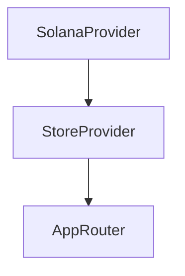
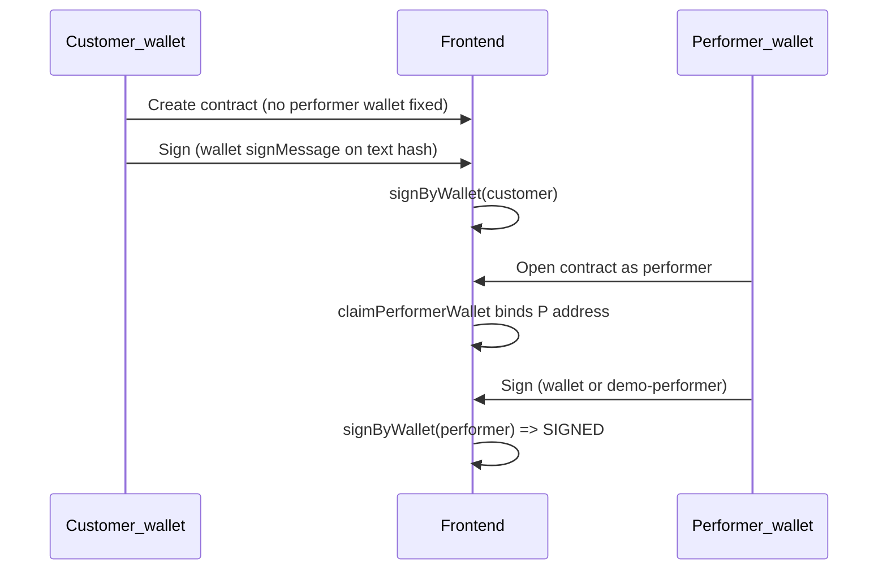

# Frontend memory bank

Reference for the current **Split** frontend: user flows, routing, state, and where implementation lives. This reflects the **MVP / demo** client: contracts live in **browser-local persisted state** (Zustand + `persist`); there is **no live backend contract API** wired into these screens yet.

---

## Stack

| Area | Choice |
| --- | --- |
| Runtime | React 19, TypeScript |
| Build | Vite |
| Routing | `react-router-dom` |
| Wallet | `@solana/wallet-adapter-react` (+ UI kit) |
| State | Zustand (`persist` for `useUserStore`, `useContractsStore`) |
| Styling | Tailwind CSS 4, design tokens in `frontend/src/index.css` |
| Icons | `@heroicons/react` (outline) |
| Crypto helpers | `@noble/hashes` (SHA-256 for contract text hash / signing payload) |

---

## Application shell

- **[`frontend/src/app/App.tsx`](frontend/src/app/App.tsx)** – wraps the tree in `SolanaProvider` then `StoreProvider`, then mounts `AppRouter`.
- **[`frontend/src/app/providers/SolanaProvider.tsx`](frontend/src/app/providers/SolanaProvider.tsx)** – wallet adapter context (not expanded here; standard adapter + modal pattern).
- **[`frontend/src/app/providers/StoreProvider.tsx`](frontend/src/app/providers/StoreProvider.tsx)** – side effects on boot: if role is `performer` and a wallet is connected, calls **`seedPerformerMockOnce(walletAddress)`** so first-time performers get a **seed contract** when they have no contracts yet (demo inbox).
- **`useWalletAuth`** ([`frontend/src/features/wallet/lib/useWalletAuth.ts`](frontend/src/features/wallet/lib/useWalletAuth.ts)) – syncs adapter `publicKey` ↔ **`useUserStore.walletAddress`**; on disconnect clears wallet and **clears role**.

Entry: [`frontend/src/main.tsx`](frontend/src/main.tsx) → `App`.

---

## Route map

| Path | Guard | Page / purpose |
| --- | --- | --- |
| `/` | — | Redirect → `/home` |
| `/start` | — | Wallet connect + role selection |
| `/home` | `ProtectedRoute` | Contract list (role-aware) |
| `/contracts/new` | `ProtectedRoute` | Pick template (customer-only redirect elsewhere) |
| `/contracts/create/:templateKey` | `ProtectedRoute` | Multi-step create wizard (customer-only) |
| `/contracts/:id` | `ProtectedRoute` | **Summary** + actions (sign, confirm completion) |
| `/contracts/:id/document` | `ProtectedRoute` | **Full document** view (HTML-like layout + hash footer) |
| `*` | — | Redirect → `/home` |

Router: [`frontend/src/app/router/AppRouter.tsx`](frontend/src/app/router/AppRouter.tsx).

**`ProtectedRoute`** ([`frontend/src/app/router/ProtectedRoute.tsx`](frontend/src/app/router/ProtectedRoute.tsx)) requires `walletAddress` and (by default) `role`; otherwise redirects to `/start`.

---

## Onboarding flow (`/start`)

Implemented in [`frontend/src/pages/start/ui/StartPage.tsx`](frontend/src/pages/start/ui/StartPage.tsx).

1. **Step 1** – user connects wallet via **`WalletConnectButton`**.
2. **Step 2** – **`RoleSelector`** sets `useUserStore.role` to `customer` or `performer`.
3. When both wallet and role exist → navigate **`/home`**.

Copy and layout use **`AuroraBackdrop`** + **`Card`** (marketing-style hero).

---

## Source layout (mental model)

The codebase follows a **layered** structure (similar in spirit to Feature-Sliced Design):

| Layer | Role | Examples |
| --- | --- | --- |
| **`app/`** | Composition root: providers, router | `App.tsx`, `ProtectedRoute`, `SolanaProvider` |
| **`pages/`** | Route-level screens | `HomePage`, `ContractViewPage`, `SelectTemplatePage` |
| **`widgets/`** | Larger UI blocks reused across pages | `ContractSummary`, `ContractDocument`, `Layout` |
| **`features/`** | User scenarios: wallet, role, contract create/sign/complete | `ContractForm`, `SignContractModal` |
| **`entities/`** | Domain models + Zustand stores | `contract`, `user` |
| **`shared/`** | UI kit, constants, decorators | `Button`, `Card`, `AuroraBackdrop` |

Aliases are configured (e.g. `@/entities/contract`).

---

## Global state

### User (`useUserStore`)

- **File:** [`frontend/src/entities/user/model/store.ts`](frontend/src/entities/user/model/store.ts)
- **Persisted:** `walletAddress`, `role`, `profile`
- **Role type:** `customer` | `performer` ([`frontend/src/entities/user/model/types.ts`](frontend/src/entities/user/model/types.ts))

Wallet address is **authoritative from the wallet adapter** via `useWalletAuth`; user profile is updated when a customer submits the create form.

### Contracts (`useContractsStore`)

- **File:** [`frontend/src/entities/contract/model/store.ts`](frontend/src/entities/contract/model/store.ts)
- **Persisted:** `contracts`, `seededPerformerWallets`

**Main actions:**

| Action | Purpose |
| --- | --- |
| `create(input, createdBy)` | Builds contract record, renders `text` from template + fields, initial `PENDING_SIGNING` |
| `signByWallet(id, signature, side)` | Stores signature blob + updates `status` from signature presence |
| `claimPerformerWallet(id, performerWallet)` | **Demo:** if `performer.walletAddress` is unset, binds the connected performer wallet so they become the on-chain party for signing |
| `markCompleted(id)` | Sets `COMPLETED` |
| `decline(id)` | Sets `DECLINED` |
| `seedPerformerMockOnce(performerWallet)` | Injects a demo **partially signed** contract if inbox is empty |

**Status derivation** is local: `PENDING_SIGNING` → `PARTIALLY_SIGNED` → `SIGNED` based on whether `signatures.customer` / `signatures.performer` exist.

Contract **type definitions:** [`frontend/src/entities/contract/model/types.ts`](frontend/src/entities/contract/model/types.ts).

---

## End-to-end demo contract flow

### Customer: create

1. **`/contracts/new`** – [`SelectTemplatePage`](frontend/src/pages/contracts/new/ui/SelectTemplatePage.tsx) – template cards.
2. **`/contracts/create/:templateKey`** – [`ContractCreatePage`](frontend/src/pages/contracts/create/ui/ContractCreatePage.tsx) embeds **`ContractForm`**.
3. **`ContractForm`** ([`frontend/src/features/contract/create/ui/ContractForm.tsx`](frontend/src/features/contract/create/ui/ContractForm.tsx)) – 6 steps, **`FormWrapper`** chrome; submit calls **`create()`** with customer party using **current `walletAddress`** and performer party **without** a fixed `walletAddress` (demo: performer attaches wallet later).

### Customer: sign

On **`/contracts/:id`**, [`ContractViewPage`](frontend/src/pages/contracts/view/ui/ContractViewPage.tsx) resolves **side** by comparing `walletAddress` to `contract.customer.walletAddress` / `contract.performer.walletAddress`. If eligible, **Sign contract** opens **`SignContractModal`**.

### Performer: see contract + attach wallet

- **Home list** ([`HomePage`](frontend/src/pages/home/ui/HomePage.tsx)): for role `performer`, shows contracts where **`performer.walletAddress` is empty** (unclaimed) **or** equals the current wallet (claimed). Customers only see contracts where they are the customer.
- **Auto-claim on open:** on `ContractViewPage`, if role is `performer`, wallet is connected, and performer wallet on the contract ist still empty, **`claimPerformerWallet(id, walletAddress)`** runs in a `useEffect`.

### Performer: sign (wallet + demo)

- **`SignContractModal`** ([`frontend/src/features/contract/sign/ui/SignContractModal.tsx`](frontend/src/features/contract/sign/ui/SignContractModal.tsx)):
  - **Primary:** `signContractText` – hashes contract text with **`computeContractTextHash`** ([`frontend/src/entities/contract/lib/textHash.ts`](frontend/src/entities/contract/lib/textHash.ts)), asks wallet to sign the hash bytes, stores base58 signature.
  - **When `signingSide === 'performer'`:** extra **“Sign with demo signature”** – calls `onSigned('demo-performer:' + nanoid)` with **no** wallet RPC (for wallets without `signMessage` or quick demos).

Parent passes **`signingSide={side}`** from `ContractViewPage`.

### Customer: confirm completion

After **`SIGNED`**, customer (same wallet as `contract.customer`) may **Confirm work completion** → **`ConfirmCompletionModal`** → **`markCompleted`**.

---

## Document vs summary UX

- **Summary:** [`ContractSummary`](frontend/src/widgets/contract/ContractSummary.tsx) composes header, parties, interactive condition tiles + modals, link to full document, and an **`actions`** slot for page-level buttons.
- **Document:** [`ContractDocumentPage`](frontend/src/pages/contracts/document/ui/ContractDocumentPage.tsx) – sticky top bar (Back + contract number), [`ContractDocument`](frontend/src/widgets/contract/ContractDocument.tsx) renders article-like sections + footer **SHA-256** of contract text (aligned with what signing hashes).

Navigation: summary uses **`ContractDocumentLink`** → `/contracts/:id/document`.

---

## Visual / layout conventions

- **Aurora:** [`AuroraBackdrop`](frontend/src/shared/ui/decor/AuroraBackdrop.tsx) with optional `fixed` for full-screen pages that scroll.
- **Global layout:** [`Layout`](frontend/src/widgets/layout/Layout.tsx) – optional Aurora, inner column **`max-w-[820px]`** for many screens.
- **Contract-heavy pages** (`ContractViewPage`, document page, create/new flows) often use **full-height wrapper** + **sticky** header:  
  `sticky top-0 z-20 bg-(--color-surface-overlay) backdrop-blur-md border-b border-(--color-border-subtle)`  
  and align inner content to **`max-w-[820px] mx-auto`**.

---

## NPM scripts (frontend)

From [`frontend/package.json`](frontend/package.json):

- `npm run dev` – Vite dev server  
- `npm run build` – `tsc -b` + production build  
- `npm run lint` – ESLint  
- `npm run format` / `format:check` – Prettier  

---

## Maintenance notes

- **Persisted stores** mean stale data survives reloads; clearing site storage resets contracts and user snapshot.
- **Seed contract** uses a fictional customer wallet string; it exists to avoid an empty performer inbox in demos—distinct from the **customer-created → performer claims** flow above.
- **Architecture doc** at [`docs/architecture.md`](architecture.md) describes the broader monorepo target (backend + on-chain); this file focuses on **what the current frontend actually implements**.
