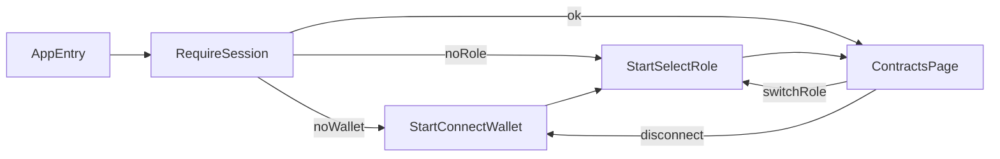
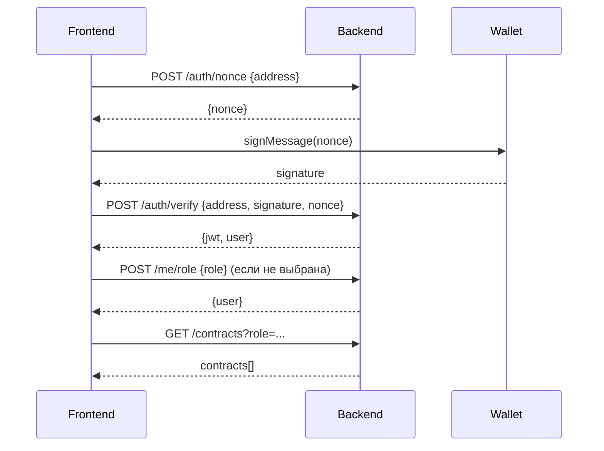

# План реализации: интерфейс с двумя ролями + 2 шага старта + Contracts + backend tasks

Контекст проекта: `Solana-based escrow platform for freelancers` (см. [package.json](../package.json)). Workspaces: `frontend`, `backend` (пустой), `contracts` (пустой). Стек фронта: `React 19 + Vite + TS + Tailwind 4 + Zustand`, FSD (см. [frontend/README.md](../frontend/README.md)).

## Терминология ролей

- `customer` — заказчик (создает контракты, депонирует средства, принимает работу).
- `user` — фрилансер/исполнитель (откликается, выполняет, получает выплату).

---

## A. FRONTEND — детальная реализация ролевого интерфейса

### A.1 Каркас приложения и маршруты

- Подключить `react-router-dom` и определить публичные/приватные маршруты:
  - `/` — редирект на первый незавершенный шаг или на `/contracts`.
  - `/start/connect-wallet` — шаг 1.
  - `/start/select-role` — шаг 2.
  - `/contracts` — главный экран (для обеих ролей, с разным наполнением).
  - `/contracts/:id` — детальная карточка контракта (опционально на этом этапе).
- Изменения в [frontend/src/app/App.tsx](../frontend/src/app/App.tsx): обернуть в `BrowserRouter`, добавить `<Routes>`, `RequireSession` guard.
- Создать `frontend/src/app/router/AppRouter.tsx` для централизации маршрутов.
- `RequireSession`: пускает в `/contracts` только если `walletConnected && role !== null`, иначе редирект на нужный шаг.

### A.2 Состояние сессии и ролевая модель

- Новый store `frontend/src/features/session/model/useSessionStore.ts` (Zustand):
  - state: `walletAddress: string | null`, `walletConnected: boolean`, `role: Role | null`, `isHydrating: boolean`, `authToken: string | null`.
  - actions: `connectWallet(address)`, `disconnectWallet()`, `selectRole(role)`, `setAuthToken(token)`, `resetSession()`.
  - persist в `localStorage` через `zustand/middleware` для удержания состояния между перезагрузками.
- Тип `Role` в `frontend/src/entities/user/model/role.ts`:
  - `export type Role = 'customer' | 'user'`.
- Хук `useCurrentRole()` и helper `isCustomer(role)`/`isFreelancer(role)` в `entities/user`.

### A.3 Шаг 1: Connect Wallet

- Feature `frontend/src/features/connect-wallet`:
  - `model/useConnectWallet.ts` — обертка над адаптером кошелька.
  - `ui/ConnectWalletButton.tsx` — кнопка подключения, состояния `idle/connecting/error`.
- Адаптер: на этапе MVP — мок (генерация фейкового адреса), интерфейс совместим с `@solana/wallet-adapter-react` (для последующей замены без переписывания UI).
- Страница `frontend/src/pages/start/connect-wallet/ui/ConnectWalletPage.tsx`:
  - заголовок, краткое описание шага, прогресс `Step 1 of 2`.
  - после успешного подключения вызывает `connectWallet(address)` и переходит на `/start/select-role`.

### A.4 Шаг 2: Select Role (ключевой ролевой выбор)

- Feature `frontend/src/features/select-role`:
  - `ui/RoleCard.tsx` — крупная карточка опции с иконкой, заголовком и описанием.
  - `ui/RoleSelector.tsx` — две карточки рядом: `customer` и `user`.
- Тексты-описания (черновые):
  - `customer`: «Я заказываю задачи и оплачиваю работу. Создаю контракты, депонирую средства».
  - `user`: «Я выполняю задачи. Беру контракты в работу и получаю оплату по факту».
- Страница `frontend/src/pages/start/select-role/ui/SelectRolePage.tsx`:
  - прогресс `Step 2 of 2`, кнопка `Continue` активна только после выбора.
  - после подтверждения: `selectRole(role)` + редирект на `/contracts`.

### A.5 Главный экран Contracts (под обе роли)

- Сущность `frontend/src/entities/contract`:
  - `model/types.ts` — `Contract`, `ContractStatus`, `ContractParty`.
  - `model/mocks.ts` — стартовые mock-данные (на 2 роли).
  - `api/contractsApi.ts` — типизированный клиент (моки на старте, потом fetch к backend).
- Виджет `frontend/src/widgets/contracts-list`:
  - `ui/ContractsList.tsx` — рендер списка с учетом роли.
  - `ui/ContractCard.tsx` — карточка элемента (заголовок, статус, сумма, контрагент, deadline).
  - `ui/ContractsFilters.tsx` — фильтры по статусу.
- Страница `frontend/src/pages/contracts/ui/ContractsPage.tsx`:
  - селектор данных через `useContracts(role)`.
  - в шапке: текущая роль, адрес кошелька, действия `Switch role` и `Disconnect`.
  - CTA, отличающийся по роли:
    - для `customer`: основная кнопка `New contract` (создать заказ).
    - для `user`: основная кнопка `Browse open contracts` (поиск открытых заказов) — на этом этапе может вести к фильтру `Open`.

### A.6 Различия UX по ролям (важная часть)

- Контентная и функциональная адаптация одного экрана `Contracts`:
  - заголовок страницы:
    - `customer`: `My orders`.
    - `user`: `My jobs`.
  - набор статусов-фильтров:
    - `customer`: `All / Draft / Funded / In progress / Review / Completed / Disputed`.
    - `user`: `All / Available / In progress / Review / Completed / Disputed`.
  - набор колонок/полей в карточке:
    - `customer` видит исполнителя (`assignee`), сумму депозита, дедлайн.
    - `user` видит заказчика (`client`), сумму выплаты, дедлайн.
  - быстрые действия по карточке:
    - `customer`: `Fund`, `Approve`, `Open dispute`.
    - `user`: `Accept`, `Submit work`, `Open dispute`.
- Все различия инкапсулировать в `entities/contract/model/roleViews.ts` (selectors/policies), чтобы UI оставался декларативным.

### A.7 Навигация и guard-логика

- Прямой переход на `/contracts` без сессии → редирект на нужный шаг.
- Прямой переход на `/start/select-role` без подключенного кошелька → редирект на `/start/connect-wallet`.
- Кнопка `Switch role` сбрасывает только `role` (адрес кошелька сохраняется) и редиректит на `/start/select-role`.
- Кнопка `Disconnect` сбрасывает сессию полностью и редиректит на `/start/connect-wallet`.

### A.8 Дизайн-токены и стили

Рекомендуемое направление — `Airy Gradient Minimal` (светлый, не темный, не «обычный белый»).

- Tailwind токены в `frontend/src/index.css`:
  - базовый фон `bg-[#FAFAFF]` + декоративные градиентные blur-пятна на онбординге.
  - акцент-роли: `customer` — пастельный персик, `user` — пастельная мята.
  - радиусы `rounded-2xl`, тени `shadow-sm`, типографика `font-medium` с заметными `tracking-tight` заголовками.
- Альтернативы (на выбор пользователю):
  1. **Soft Glass Light** — полупрозрачные карточки, легкий blur, премиум-ощущение.
  2. **Neo-Paper** — «бумажная» эстетика, пастельные ролевые маркеры.
  3. **Airy Gradient Minimal** — белый + воздушные цветные пятна (рекомендация).
  4. **Editorial Tech Light** — журнальная типографика, строгие data-блоки.

### A.9 Тестирование фронта

- Unit: `useSessionStore` (переходы состояний, persist), селекторы `roleViews`.
- Integration: route guards (3 сценария — без кошелька, без роли, готовая сессия).
- Smoke: открытие `/contracts` под `customer` и под `user` показывает правильный заголовок и набор фильтров.

### A.10 Поток приложения

---

## B. BACKEND — задачи для нового workspace

Бэкенд-папка `backend/` сейчас пустая. Ниже — последовательные задачи под MVP, согласованные с фронтом и ролевой моделью.

### B.1 Bootstrap backend workspace

- Инициализировать `backend/package.json` как часть npm workspaces (уже подключен в [package.json](../package.json)).
- Стек по умолчанию (предложение): `Node.js 20 + TypeScript + Fastify + Zod + Prisma + PostgreSQL` (Fastify — легче и быстрее под REST/SSE; альтернатива — `NestJS`, если нужен «кор-фреймворк»).
- Добавить:
  - `tsconfig.json`, `eslint`, `prettier` (унифицировать с фронтом).
  - скрипты `dev`, `build`, `start`, `lint`, `test`.
  - `src/index.ts` — bootstrap сервера, `src/app.ts` — фабрика приложения.
  - конфиг через `dotenv` (`.env.example` с переменными `DATABASE_URL`, `JWT_SECRET`, `SOLANA_CLUSTER`).

### B.2 Аутентификация по кошельку (Solana Sign-In)

- Эндпоинты:
  - `POST /auth/nonce` — выдает разовый `nonce` для адреса.
  - `POST /auth/verify` — принимает `{ address, signature, nonce }`, проверяет подпись `ed25519` через `@solana/web3.js` / `tweetnacl`, выдает JWT.
  - `POST /auth/logout` — инвалидация refresh-токена (если решим хранить).
- JWT payload: `{ sub: address, role: Role | null, iat, exp }`.
- На фронте: после `verify` сохранить токен в `useSessionStore.authToken`.

### B.3 Ролевая модель и middleware

- Сущность `User`:
  - `id` (uuid), `walletAddress` (unique), `role` (`customer` | `user` | `null`), `createdAt`.
- Эндпоинты:
  - `GET /me` — текущий пользователь (по JWT).
  - `POST /me/role` — установка роли (только если еще не установлена) с телом `{ role: 'customer' | 'user' }`.
  - `PATCH /me/role` — смена роли (поведение обсуждаемо: разрешить или запретить — см. вопросы ниже).
- Middleware:
  - `requireAuth` — проверка JWT.
  - `requireRole(roles[])` — фильтр доступа к ролевым ручкам.

### B.4 Доменная модель Contract

- Поля минимального MVP:
  - `id` (uuid), `title`, `description`, `amount` (lamports/SOL), `currency` (`SOL`/`USDC`), `status` (`draft | open | funded | in_progress | review | completed | disputed | cancelled`), `clientAddress`, `assigneeAddress | null`, `deadline`, `createdAt`, `updatedAt`, `onchainAddress | null` (когда привязан к смарт-контракту в `contracts/`).
- Миграции через Prisma; индексы на `clientAddress`, `assigneeAddress`, `status`.

### B.5 REST API для контрактов

- Под `customer`:
  - `POST /contracts` — создать черновик/открытый контракт.
  - `GET /contracts?role=customer&status=...` — список своих заказов.
  - `PATCH /contracts/:id` — редактирование пока в статусе `draft`.
  - `POST /contracts/:id/fund` — зафиксировать факт фандинга (после on-chain транзакции).
  - `POST /contracts/:id/approve` — принять работу.
  - `POST /contracts/:id/dispute` — открыть спор.
- Под `user`:
  - `GET /contracts?role=user&status=available` — список доступных контрактов.
  - `GET /contracts?role=user&status=mine` — мои текущие.
  - `POST /contracts/:id/accept` — принять контракт в работу.
  - `POST /contracts/:id/submit` — отправить результат на ревью.
  - `POST /contracts/:id/dispute` — открыть спор.
- Общие:
  - `GET /contracts/:id` — детальная карточка с проверкой, что вызывающий — `client` или `assignee`.
- Все ручки — JWT-protected, плюс `requireRole` там, где это критично.

### B.6 Связка с Solana / on-chain

- Завести модуль `backend/src/integrations/solana` (RPC через `@solana/web3.js`).
- Верификация on-chain событий (фандинг, релиз средств) через подписки/поллинг — отдельная задача после первого MVP API.
- Договориться о формате `onchainAddress` и событий со слоем `contracts/` (smart-contracts workspace, сейчас пустой).

### B.7 Качество и DX

- Валидация запросов через `Zod` (или `TypeBox`), общая схема ошибок (`{ code, message, details? }`).
- Логирование (`pino`), базовый rate-limit на `auth/*`.
- Тесты: unit для сервисов, integration для роутов (Vitest + supertest).
- OpenAPI (через `fastify-swagger`) — облегчит интеграцию на фронте.

### B.8 Контракт API ↔ фронт

- Зафиксировать общий пакет типов в `frontend/src/entities` и `backend/src/types` (на старте можно дублировать руками; позже вынести в `packages/shared`).
- Согласовать ровно те статусы и фильтры, которые использует UI (см. A.6), чтобы избежать рассинхронизации между ролями и backend-выборками.

### B.9 Поток аутентификации с бэком

---

## C. Открытые вопросы (повлияют на план)

- Кошелек: использовать `@solana/wallet-adapter` сразу или начать с мока и подменить позже?
- Смена роли после онбординга: разрешить свободно или только через support/единоразово?
- Бэкенд-фреймворк: `Fastify` (предлагаю) vs `NestJS` (если требуется DI/модульность из коробки)?
- БД: `PostgreSQL + Prisma` (предлагаю) или `Mongo + Mongoose`?
- Нужен ли в MVP отдельный экран `/contracts/:id` или достаточно списка с inline-действиями?

## D. Рекомендованный порядок исполнения

1. A.1–A.4: каркас, store, оба шага старта (с мок-кошельком).
2. A.5–A.6: базовый `Contracts` под обе роли на mock-данных.
3. B.1–B.3: bootstrap backend + auth + роли.
4. B.4–B.5: доменная модель и REST API контрактов.
5. A.5 → переключение фронта с моков на реальный API.
6. B.6: интеграция с Solana / событиями смарт-контракта.
