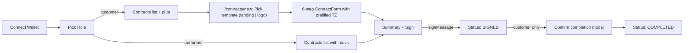
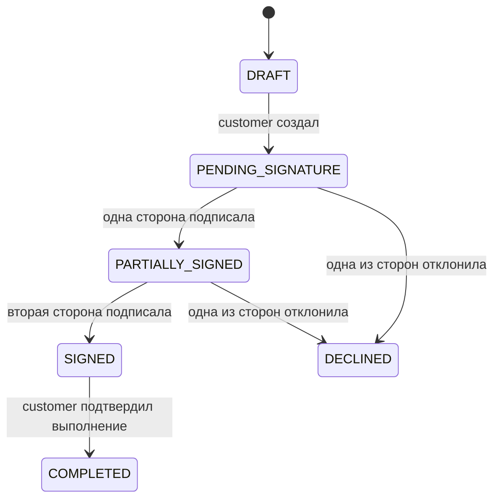
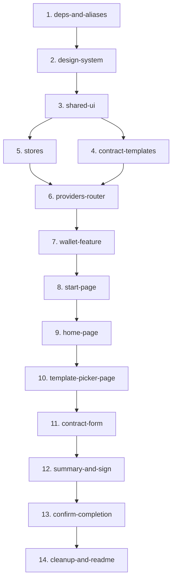

# Миграция `frontend_src` → `frontend` (Solana MVP)

> Технический документ описывает перенос дизайна и UI-ядра из исследовательского проекта `frontend_src` в новый рабочий пакет `frontend` под Solana-MVP с двумя ролями (`customer` / `performer`). Бэкенд для MVP заменяется Zustand-сторами с `persist`, аутентификация и подпись — через `@solana/wallet-adapter-react`. Источник плана: [`solana-mvp-migration_c6f2530b.plan.md`](../.cursor/plans/solana-mvp-migration_c6f2530b.plan.md).

## Содержание

1. [Цели и не-цели MVP](#цели-и-не-цели-mvp)
2. [Пользовательский поток](#пользовательский-поток)
3. [Архитектурные решения](#архитектурные-решения)
4. [Стек и зависимости](#стек-и-зависимости)
5. [Структура проекта](#структура-проекта)
6. [Роутинг и guard-логика](#роутинг-и-guard-логика)
7. [Модель данных](#модель-данных)
8. [Шаблоны контрактов (templates)](#шаблоны-контрактов-templates)
9. [Форма создания контракта (6 шагов)](#форма-создания-контракта-6-шагов)
10. [Solana-провайдер и подпись](#solana-провайдер-и-подпись)
11. [State management (Zustand-сторы)](#state-management-zustand-сторы)
12. [Что переносим / что выбрасываем](#что-переносим--что-выбрасываем)
13. [Дорожная карта (чеклист этапов)](#дорожная-карта-чеклист-этапов)
14. [Замечания и ограничения](#замечания-и-ограничения)

---

## Цели и не-цели MVP

### Цели

- Перенести проверенное UI-ядро (формы, модалки, токены, типографику) из `frontend_src` в новый `frontend` — **без backend-зависимостей**.
- Запустить минимальный поток «подключил кошелёк → выбрал роль → создал контракт по шаблону → подписал» полностью на клиенте.
- Обеспечить чистую архитектуру FSD, готовую к подключению реального бэкенда без переписывания UI.
- Зафиксировать два предзаписанных шаблона договоров: `Landing page development` и `Logo design`.

### Не-цели (намеренно вне MVP)

- **Никакого** реального on-chain взаимодействия (escrow, фандинг, релиз средств) — подпись сообщения это всё.
- **Никакого** бэкенда: ни REST, ни WebSocket, ни React Query / axios.
- **Никаких** сторонних провайдеров: Privy, Telegram WebApp, TON Connect, Sumsub/KYC, Sentry, NProgress.
- **Никакого** PDF-рендеринга, QR-сканера, Swiper-каруселей.
- **Никаких** сложных фильтров: только статус-табы (поиск, jurisdiction-фильтры, dateRange — всё это вне MVP).

---

## Пользовательский поток



### Ключевые точки потока

| Этап | Роль | Действие | Результат |
|---|---|---|---|
| Старт | — | `WalletConnectButton` | `useUserStore.walletAddress` записан |
| Выбор роли | — | `RoleSelector` (две карточки) | `useUserStore.role` записан, `seedPerformerMockOnce` для performer |
| Список контрактов | обе | `HomePage` со статус-табами | `customer` видит кнопку «+», `performer` — без неё |
| Выбор шаблона | customer | `SelectTemplatePage` | переход на `/contracts/create/:templateKey` |
| Заполнение формы | customer | `ContractForm` (6 шагов) | `useContractsStore.create()` |
| Подписание | обе | `signMessage(SHA256(contractText))` | статус → `SIGNED` |
| Подтверждение работ | customer | `ConfirmCompletionModal` | статус → `COMPLETED` |

---

## Архитектурные решения

### Wallet Standard auto-discovery

Используем **только базовые пакеты** wallet-адаптера:

- `@solana/wallet-adapter-react`
- `@solana/wallet-adapter-react-ui`
- `@solana/wallet-adapter-base`
- `@solana/web3.js`

**НЕ ставим** `@solana/wallet-adapter-wallets` и индивидуальные `@solana/wallet-adapter-phantom` / `-solflare` / `-backpack`. Современные кошельки (Phantom, Solflare, Backpack) сами регистрируются в браузере через [Wallet Standard](https://github.com/wallet-standard/wallet-standard), и `WalletProvider` подхватывает их автоматически с `wallets={[]}`. Это даёт **минимальный bundle** без потери совместимости.

### Подпись = signMessage (не транзакция)

Подписание контракта в MVP — это `signMessage(SHA256(renderContractText(contract)))`. Никаких реальных on-chain транзакций. `Confirm completion` — просто запись в локальный стор.

### Backend = Zustand + persist

Полностью клиентское приложение, состояние сохраняется в `localStorage`:

- `useUserStore` — кошелёк, роль, профиль исполнителя.
- `useContractsStore` — массив контрактов и CRUD-операции.

Архитектурно сторы изолированы в `entities/*/model/store.ts`, чтобы при появлении бэкенда заменить их на API-обёртки без изменений в UI.

### Иконки

`@heroicons/react/24/outline` (по умолчанию), `24/solid` — точечно. Кастомный SVG — **только** бренд-логотип (`shared/icons/LogoIcon.tsx`). Все иконки из `frontend_src/public/assets/icons/*.svg` **не переносим**.

### Шаблоны = клиентские пресеты текста

Никакого `templateApi`, `editions`, `parameters`. У каждого шаблона есть:

- `defaultSubject` — дефолтный предмет договора;
- `defaultTechnicalAssignment` — длинный текст ТЗ для редактирования;
- `renderContractText(contract)` — функция, генерирующая финальный текст договора с подстановкой полей.

### Область работ

Все изменения — в `frontend/`. `frontend_src/` используется **только как source** для копирования (read-only). Lockfile и зависимости — `frontend/package-lock.json`, `frontend/package.json`.

---

## Стек и зависимости

### Runtime-зависимости (`frontend/package.json`)

```text
react-router-dom              # маршрутизация
react-hook-form               # форма контракта (6 шагов)
@heroicons/react              # иконки
@solana/web3.js               # Solana RPC + типы
@solana/wallet-adapter-react  # Wallet React-контекст
@solana/wallet-adapter-react-ui  # WalletModal
@solana/wallet-adapter-base   # базовые типы
@noble/hashes                 # SHA-256 для подписи
bs58                          # base58 кодирование подписи
nanoid                        # id для контрактов
buffer, process               # browser-полифиллы
zustand                       # state management
```

> **Намеренно отсутствуют**: `@solana/wallet-adapter-wallets`, `axios`, `@tanstack/react-query`, `swiper`, `nprogress`, `qrcode`, `html5-qrcode`, `@react-pdf/renderer`, `@privy-io/*`, `@tonconnect/*`, `@sumsub/*`.

### Vite-конфиг

В `vite.config.ts` обязательно:

- алиас `@/* -> src/*`;
- полифиллы `buffer` и `process` (`define: { 'process.env': {} }` + `optimizeDeps.esbuildOptions.define.global = 'globalThis'`);
- импорт стилей `@solana/wallet-adapter-react-ui/styles.css` в `App.tsx` или в `index.css`.

### TypeScript

В `tsconfig.app.json` — соответствующий алиас `paths`:

```json
"paths": { "@/*": ["src/*"] }
```

---

## Структура проекта

Архитектура — **Feature-Sliced Design**. Слои сверху вниз: `app` → `pages` → `widgets` → `features` → `entities` → `shared`.

```text
frontend/src/
  app/
    App.tsx
    index.css                       # токены + шрифты
    providers/
      SolanaProvider.tsx            # ConnectionProvider + WalletProvider + WalletModalProvider
      RouterProvider.tsx            # BrowserRouter
      StoreProvider.tsx             # passthrough (зарезервирован)
    router/
      AppRouter.tsx
      ProtectedRoute.tsx            # требует walletAddress + role
  pages/
    start/StartPage.tsx             # 2 шага: connect + role
    home/HomePage.tsx               # список + статус-табы + +button (только customer)
    contracts/
      new/SelectTemplatePage.tsx    # 2 карточки: landing-development | logo-design
      create/ContractCreatePage.tsx # /contracts/create/:templateKey, рендерит ContractForm
      view/ContractViewPage.tsx     # Summary + Sign + Confirm
  widgets/
    layout/Layout.tsx
    header/Header.tsx
    contract/
      card/{ContractCard,StatusBadge}.tsx
      filters/StatusFilterButtons.tsx
  features/
    wallet/
      ui/WalletConnectButton.tsx
      lib/useWalletAuth.ts
    role/
      ui/RoleSelector.tsx
    contract/
      create/
        ui/ContractForm.tsx
        ui/steps/{Step1Parties,Step2TechnicalAssignment,Step3Subject,Step4Duration,Step5Cost,Step6Jurisdiction}.tsx
        lib/useContractCreateForm.ts
        model/types.ts
      summary/
        ui/{ContractSummary,ContractPartiesSection,ContractConditionsSection,ContractActionsSection,ContractSummaryHeader}.tsx
      sign/
        ui/SignContractModal.tsx
        lib/useContractSigning.ts   # signMessage(sha256(text))
      confirm-completion/
        ui/ConfirmCompletionModal.tsx
        lib/useConfirmCompletion.ts
      lib/
        renderContractText.ts
  entities/
    contract/
      model/{types,store,mocks,statusMap,templates}.ts
    user/
      model/{types,store,defaults}.ts
  shared/
    ui/
      form/{Wrapper,FormWrapper,Container,Input,Textarea,Dropdown,Tabs,DateInput}/
      modal/{Modal,BottomModal,ResultModal}/
    icons/LogoIcon.tsx              # ТОЛЬКО бренд-логотип
    constants/{countries,currencies}.ts
    lib/hooks/useIsDesktop.ts
    config/fsd.md
```

---

## Роутинг и guard-логика

```text
/                              StartPage (connect wallet + select role)
/home                          HomePage              [protected: wallet + role]
/contracts/new                 SelectTemplatePage    [protected, customer only]
/contracts/create/:templateKey ContractCreatePage    [protected, customer only]
/contracts/:contractId         ContractViewPage      [protected]
*                              -> /
```

### `ProtectedRoute`

```ts
const { walletAddress, role } = useUserStore();
if (!walletAddress || !role) return <Navigate to="/" replace />;
```

Дополнительные guard-чеки:

- `customer-only` маршруты (`/contracts/new`, `/contracts/create/:templateKey`) — редирект на `/home`, если `role !== 'customer'`.
- При дисконнекте кошелька — `useUserStore.clear()` и редирект на `/`.

---

## Модель данных

### Контракт

```ts
// entities/contract/model/types.ts
export type ContractStatus =
  | 'DRAFT'
  | 'PENDING_SIGNATURE'
  | 'PARTIALLY_SIGNED'
  | 'SIGNED'
  | 'COMPLETED'
  | 'DECLINED';

export type TemplateKey = 'landing-development' | 'logo-design';

export type Party = {
  firstName: string;
  lastName: string;
  email: string;
  companyName?: string;
  walletAddress?: string;
};

export type Contract = {
  id: string;
  createdAt: string;
  createdByWallet: string;
  status: ContractStatus;
  templateKey: TemplateKey;
  customer: Party;
  performer: Party;
  technicalAssignment: string;        // изначально из templates[templateKey].defaultTechnicalAssignment
  subject: string;
  startDate: string;
  endDate: string;
  amount: number;
  currency: string;
  jurisdiction: string;
  additionalTerms?: string;
  contentHash?: string;
  signatures: { customer?: string; performer?: string };
};
```

### Жизненный цикл статусов



---

## Шаблоны контрактов (templates)

```ts
// entities/contract/model/templates.ts
export type TemplateDefinition = {
  key: TemplateKey;
  label: string;                                      // 'Landing page development'
  description: string;                                // короткое описание для карточки
  defaultSubject: string;                             // 'Разработка лендинга для проекта…'
  defaultTechnicalAssignment: string;                 // длинный текст ТЗ для редактирования
  renderContractText: (contract: Contract) => string; // финальный текст договора
};

export const TEMPLATES: Record<TemplateKey, TemplateDefinition> = {
  'landing-development': { /* … */ },
  'logo-design':         { /* … */ },
};
```

### Контракт `renderContractText`

Функция:

1. Получает заполненный объект `Contract` (с уже отредактированным пользователем `technicalAssignment`).
2. Подставляет поля сторон (`customer`, `performer`), `subject`, `startDate`, `endDate`, `amount`, `currency`, `jurisdiction`, `additionalTerms`.
3. Встраивает `contract.technicalAssignment` как раздел «Техническое задание».
4. Возвращает готовую строку — она используется и в превью (`SignContractModal`), и в подписи (`signMessage(SHA256(text))`).

---

## Форма создания контракта (6 шагов)

`features/contract/create/ui/ContractForm.tsx` принимает `templateKey` из URL, использует `FormWrapper` + `react-hook-form`. `defaultValues` инициализируются из `TEMPLATES[templateKey]` + `useUserStore.profile`.

| Шаг | Компонент | Поля | Особенности |
|---|---|---|---|
| 1 | `Step1Parties` | `customer.{firstName,lastName,email,companyName}` | Поля исполнителя read-only, прокинуты из `useUserStore.profile` |
| 2 | `Step2TechnicalAssignment` | `technicalAssignment` | **Fill-height textarea**, prefilled из `defaultTechnicalAssignment` |
| 3 | `Step3Subject` | `subject` | Input, prefilled из `defaultSubject` |
| 4 | `Step4Duration` | `startDate`, `endDate` | Два `DateInput` |
| 5 | `Step5Cost` | `amount`, `currency` | Input number + Dropdown валют (упрощённо, без `paymentTerms`) |
| 6 | `Step6Jurisdiction` | `jurisdiction` | Dropdown стран |

### Доработка `Textarea` для Step2

Добавляется проп `fillHeight?: boolean`:

```tsx
<textarea
  className={fillHeight ? 'flex-1 resize-none min-h-[60vh] md:min-h-[55vh]' : '...'}
  rows={fillHeight ? undefined : rows}
  ...
/>
```

В Step2 textarea растягивается по доступной высоте контейнера, чтобы пользователь видел весь длинный пресет ТЗ без скролла.

### `additionalTerms`

Поле **не входит в шаги формы**. Оно вынесено на страницу `Summary` под основными условиями как опциональный `EditableTextarea` («Add additional terms»).

### `Submit` формы

```ts
const onSubmit = (data) => {
  const contract = useContractsStore.getState().create({
    ...data,
    templateKey,
    performer: useUserStore.getState().profile,
    createdByWallet: useUserStore.getState().walletAddress,
  });
  navigate(`/contracts/${contract.id}`);
};
```

---

## Solana-провайдер и подпись

### Провайдер

```tsx
// app/providers/SolanaProvider.tsx
import { ConnectionProvider, WalletProvider } from '@solana/wallet-adapter-react';
import { WalletModalProvider } from '@solana/wallet-adapter-react-ui';
import { clusterApiUrl } from '@solana/web3.js';
import { useMemo } from 'react';
import '@solana/wallet-adapter-react-ui/styles.css';

const endpoint = clusterApiUrl('devnet');

export function SolanaProvider({ children }: { children: React.ReactNode }) {
  // Wallet Standard auto-discovery: пустой массив достаточен.
  const wallets = useMemo(() => [], []);
  return (
    <ConnectionProvider endpoint={endpoint}>
      <WalletProvider wallets={wallets} autoConnect>
        <WalletModalProvider>{children}</WalletModalProvider>
      </WalletProvider>
    </ConnectionProvider>
  );
}
```

### Подпись

```ts
// features/contract/sign/lib/useContractSigning.ts
import { useWallet } from '@solana/wallet-adapter-react';
import { sha256 } from '@noble/hashes/sha256';
import { bytesToHex } from '@noble/hashes/utils';
import bs58 from 'bs58';
import { TEMPLATES } from '@/entities/contract/model/templates';
import { useContractsStore } from '@/entities/contract/model/store';

export function useContractSigning() {
  const { publicKey, signMessage } = useWallet();

  return async (contract: Contract, role: 'customer' | 'performer') => {
    if (!publicKey || !signMessage) throw new Error('Wallet not connected');

    const text = TEMPLATES[contract.templateKey].renderContractText(contract);
    const hash = sha256(new TextEncoder().encode(text));
    const signature = await signMessage(hash);

    useContractsStore
      .getState()
      .sign(contract.id, role, bs58.encode(signature), bytesToHex(hash));
  };
}
```

### Связка кошелька со стором

```ts
// features/wallet/lib/useWalletAuth.ts
useEffect(() => {
  if (publicKey) {
    useUserStore.getState().setWalletAddress(publicKey.toBase58());
  } else {
    useUserStore.getState().clear(); // disconnect → стираем role и profile
  }
}, [publicKey]);
```

---

## State management (Zustand-сторы)

### `useUserStore`

```ts
// entities/user/model/store.ts
type UserState = {
  walletAddress: string | null;
  role: 'customer' | 'performer' | null;
  profile: Party | null;             // хардкод-профиль для performer
  setWalletAddress: (addr: string | null) => void;
  setRole: (role: 'customer' | 'performer') => void;
  clear: () => void;
};
```

При `setRole('performer')` — записывается дефолтный `profile` из `entities/user/model/defaults.ts` и однократно вызывается `useContractsStore.seedPerformerMockOnce()`.

### `useContractsStore`

```ts
// entities/contract/model/store.ts
type ContractsState = {
  contracts: Contract[];
  hasSeededPerformerMock: boolean;
  create: (input: ContractInput) => Contract;
  sign: (id: string, role: 'customer' | 'performer', signature: string, hash: string) => void;
  confirmCompletion: (id: string) => void;
  getById: (id: string) => Contract | undefined;
  seedPerformerMockOnce: () => void;
};
```

Оба стора оборачиваются в `persist` middleware с ключами `solana-mvp-user` и `solana-mvp-contracts`.

### `seedPerformerMockOnce`

При первом выборе роли `performer` создаётся **один** контракт по `landing-development` шаблону от воображаемого заказчика — чтобы у performer был не пустой `HomePage`. Флаг `hasSeededPerformerMock` гарантирует одноразовость.

---

## Что переносим / что выбрасываем

### Переносим 1:1

**Дизайн-система**:

- CSS-токены и `@font-face` из `frontend_src/src/app/index.css` → `frontend/src/index.css` (без `swiper`, `ton-connect`, `nprogress`).
- Шрифты из `frontend_src/public/assets/fonts/` → `frontend/public/assets/fonts/`.
- `LogoIcon.tsx`, `countries.ts`, `currencies.ts`.

**Shared UI** (формы и модалки 1:1):

- `Wrapper`, `FormWrapper`, `Container`
- `Input`, `Textarea` (+`fillHeight` проп), `Dropdown`, `Tabs`, `DateInput` (+`Calendar`)
- `Modal`, `BottomModal`, `ResultModal`

**Виджеты и страницы (с упрощениями)**:

- `Layout` — без `HeaderVisibilityProvider` и `useAuth`.
- `Header` — без `useHeaderVisibility`.
- `ContractCard` — только ветка `homePageMode=true`.
- `StatusBadge` — упрощённый под наши 6 статусов.
- `StatusFilterButtons` — `swiper` заменяется на `flex overflow-x-auto`.
- `PartyWidget`, `ContractConditionWidget`, `ContractConditionGroup` — для Summary.

### Выбрасываем

| Категория | Что именно |
|---|---|
| **Auth/Identity** | `entities/auth`, `entities/profile`, `entities/kyc`, Privy, Telegram WebApp, Sumsub, email-модалки |
| **Billing** | `entities/billing`, `BillingApi`, `ContractsOverModal` |
| **Templates v2** | `entities/template`, `entities/edition`, `entities/signatory`, `templateApi`, `editions/parameters` |
| **TON** | `entities/ton`, `features/ton/*`, `TonConnect` |
| **Доп. формы** | NDAForm, RentForm, LoanForm и весь `templateId === N` свитч в старом `ContractForm` |
| **Хуки** | `useFormDataCache`, `useContractWorkflow`, `useContractSync`, `useContractSignatures`, `useContractMutations`, `useContractQueries` |
| **Селекторы** | `extractEditionActions`, `selectEditionById`, `convertContractToExtendedFormData` |
| **Поиск/фильтры** | `ContractSearchInput`, advanced filters (jurisdiction/parties/dateRange/contractType) |
| **Документы** | `DocumentViewer`, `@react-pdf/renderer`, QR-сканер (`qrcode`, `html5-qrcode`) |
| **Сетевой слой** | `react-query`, `axios`, любой WebSocket |
| **UI-библиотеки** | `swiper`, `nprogress` |
| **Иконки** | весь `shared/icons` кроме `LogoIcon`; все `*.svg` из `public/assets/icons/` (заменяем на `@heroicons/react`) |

---

## Дорожная карта (чеклист этапов)

Ниже — план реализации с привязкой к id из исходного плана. Этапы упорядочены по зависимостям.

| # | id | Описание | Статус |
|---|---|---|---|
| 1 | `deps-and-aliases` | Зависимости в `frontend/package.json`, алиас `@/*` в `vite.config.ts` и `tsconfig.app.json`, полифиллы `buffer`/`process` | ✅ completed |
| 2 | `design-system` | Шрифты в `public/assets/fonts`, CSS-токены и `@font-face` в `index.css`, `LogoIcon`, `constants/{countries,currencies}.ts` | ✅ completed |
| 3 | `shared-ui` | Перенос форм и модалок 1:1, добавление `fillHeight` в `Textarea`, замена иконок на `@heroicons/react` | 🟡 in progress |
| 4 | `contract-templates` | `entities/contract/model/templates.ts` с двумя шаблонами и `renderContractText` | ⏳ pending |
| 5 | `stores` | `useUserStore`, `useContractsStore` с `persist` и `seedPerformerMockOnce` | ⏳ pending |
| 6 | `providers-router` | `SolanaProvider`, `BrowserRouter`, `ProtectedRoute`, чистка демо `HomePage` с counter | ⏳ pending |
| 7 | `wallet-feature` | `WalletConnectButton` + `useWalletAuth` (связка `publicKey` ↔ стор, clear при disconnect) | ⏳ pending |
| 8 | `start-page` | `StartPage`: connect → `RoleSelector` → `navigate('/home')` | ⏳ pending |
| 9 | `home-page` | `HomePage`: `Layout` + `Header` + `StatusFilterButtons` + список `ContractCard`, кнопка «+» только для `customer` | ⏳ pending |
| 10 | `template-picker-page` | `SelectTemplatePage`: две карточки шаблонов | ⏳ pending |
| 11 | `contract-form` | `ContractForm` с 6 шагами, prefilled из шаблона и профиля | ⏳ pending |
| 12 | `summary-and-sign` | `ContractViewPage`: `ContractSummary` + кнопки `Sign contract` / `View contract text`, `useContractSigning` | ⏳ pending |
| 13 | `confirm-completion` | `ConfirmCompletionModal` (только `customer` при `SIGNED`), запись `COMPLETED` в стор + `ResultModal` | ⏳ pending |
| 14 | `cleanup-and-readme` | Удалить демо `increment-counter` и связанные файлы, обновить `frontend/README.md` | ⏳ pending |

### Граф зависимостей этапов



---

## Замечания и ограничения

### Совместимость с React 19

- `react-hook-form@^7.68` — **совместим** с React 19, актуальная версия в плане — `^7.75`.
- `@solana/wallet-adapter-react@^0.15.39` — корректно работает с React 19.
- `react-router-dom@^7.x` — рекомендуемая версия для проекта.

### Шрифты и ассеты

- Шрифты копируются `frontend_src/public/assets/fonts/ → frontend/public/assets/fonts/`.
- SVG-иконки из `frontend_src/public/assets/icons/` **не копируем** — все иконки берутся из `@heroicons/react`.
- Бренд-логотип — единственное исключение, остаётся как inline-SVG-компонент.

### Очистка CSS-токенов

При переносе из старого `index.css` следует выкинуть:

- TON Connect стили (`ton-connect-button-custom`);
- `swiper`-стили;
- `nprogress`-стили;
- Badge-цвета для статусов, которых у нас нет: `READY_FOR_SIGN`, `EXPIRED`, `CANCELLED`.

### Vite-конфиг: полифиллы

Solana-стек требует `Buffer` и `process` в браузере:

```ts
// vite.config.ts (фрагмент)
define: {
  global: 'globalThis',
  'process.env': {},
},
optimizeDeps: {
  esbuildOptions: {
    define: { global: 'globalThis' },
    plugins: [
      // если потребуется — NodeGlobalsPolyfillPlugin для buffer/process
    ],
  },
},
```

### Контентная задача

Тексты пресетов ТЗ (1–2 экрана осмысленного текста на каждый шаблон) пишутся в `templates.ts` на этапе реализации — это **контентная задача**, не блокирует архитектуру. Для черновика можно использовать `lorem ipsum` с правильной разметкой (заголовки разделов, списки требований).

### Devnet vs Mainnet

В MVP жёстко зашит `clusterApiUrl('devnet')`. При выходе на продакшн — вынести endpoint в env-переменную (`VITE_SOLANA_CLUSTER`).

---

## Связанные документы

- [Исходный план](../.cursor/plans/solana-mvp-migration_c6f2530b.plan.md)
- [Общий implementation-plan](./implementation-plan.md) — расширенная версия с backend-задачами (вне MVP).
- [`frontend/README.md`](../frontend/README.md) — структура нового проекта (обновляется в этапе 14).
